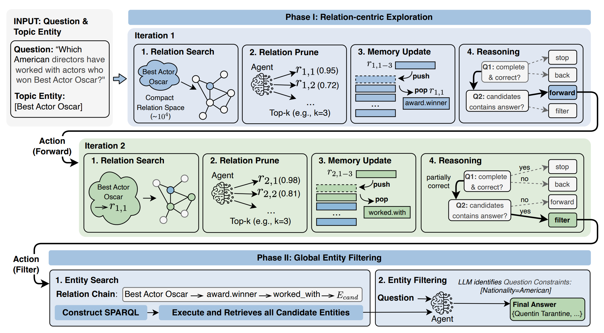

# Chain-of-Relations

*Chain-of-Relations: Faithful and Efficient LLM Reasoning over Knowledge Graphs via Relation-Centric Exploration*

🥳 This paper has been accepted to Findings of ACL 2026.

## Knowledge Base Setup

### Freebase

For Freebase deployment and configuration, please refer to the [DataArcTech/ToG Freebase Setup guide](https://github.com/DataArcTech/ToG/tree/main/Freebase).

### Wikidata

For Wikidata, you can either follow the [DataArcTech/ToG Wikidata Setup guide](https://github.com/DataArcTech/ToG/tree/main/Wikidata) for self-hosted deployment or use the official [Wikidata Query Service](https://www.wikidata.org/wiki/Wikidata:SPARQL_query_service).

## Chain-of-Relations



### How to Run?

You can run Chain-of-Relations with the example script [scripts/run_cor.sh](scripts/run_cor.sh):

```bash
sh scripts/run_cor.sh
```


## How to Cite?

If you use CoR or any code from this repository in your research, please cite the following paper.

```
@inproceedings{liu2026cor,
  title={Chain-of-Relations: Faithful and Efficient LLM Reasoning over Knowledge Graphs via Relation-Centric Exploration},
  author={Liu, Chenhui and Zhou, Jianpeng and Wang, Jiahai},
  booktitle={Findings of the Association for Computational Linguistics: ACL 2026},
  year={2026}
}
```
